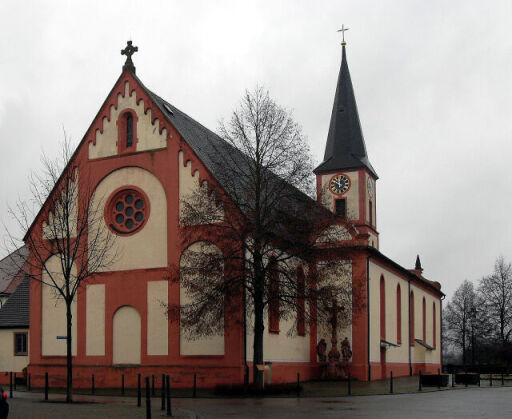

#  for Rubyists

---

## Rust in Baden



---

### How I came to rust

- Looking for a *20% Language*
- Looking for "modern C"

---

### Selling points of rust

- Performance
- Memory-Safety without a GC
- Zero-Cost-Abstrations
- 

---

## Designed to replace C/C++

---

### What it's not

- Easy to pick up
- (unless you are well versed in C++ **and** Haskell)

---

#### Differences to [red](**ruby**)

1. The stack is back
1. Immutable by default
1. No "real" meta-programming
1. Data/Behaviour separated
1. **Ownership**

---

### Ownership (fighting the Borrow-Checker)

1. Every value has **one**(1) variable that "owns" it
1. If the variable goes out of scope, the value it freed

```rust
  let x = "cake";
  eat(x);
  have_it_to(x); // Won't compile
```
1. You can **borrow** though
```rust
  let x = "cake";
  eat(&x); // Only borrowed. So we give the cake back after eating it. Urgh...
  have_it_to(x); // Will compile!
```
---

#### How does that help?

- No garbage collector needed!
- No more memory allocation!
- Fearless concurrency!
    - No more data races

---

#### How does that hinder you?

- Global mutable state is possible, but really hard to do. So don't.
- Stuff like a graph is non trivial:
```rust
struct Node<T> {
  value: T,
  neighbors: Vec<Node<T>>,
}

let first_node = Node { value: 7, neighbors: vec![] };
// first_node is **moved** here
let second_node = Node { value: 5, neighbors: vec![first_node] };
// Use after move
let third_node = Node { value: 20, neighbors: vec![first_node] };
```
---
### Immutability by default
- All variables are immutable by default
```rust
let x = 7;
x = 9; // NoNoNo!
```
- Possible to make things mutable
```rust
let mut x = 7;
x = 9; // Ok!
```
---
#### How does that help?
1. No accidental mutations
1. Signatures are very descriptive (combined with ownership)
```rust
// Consumes value, returns nothing (cannot be assigned)
fn eat_it(c: Cake) {}

// Consumes value, returns another **different** value
fn recycle(c: Cake) -> Cake {}

// Reads value. Nothing more.
fn look_at(c: &Cake) {}

// Changes the cake we pass into it. 
fn decorate(c: &mut Cake) -> &mut Cake {}
```
---
#### Zero cost abstractions
1. High level concepts in low level language
1. Most gets compiled away
1. Example: Iterators
```rust
let numbers = vec![1, 2, 3, 4];
numbers.iter().map(|i| i + 2).map(|i| i * 2) // Lazy and chainable
```
#### Fearless concurrency
1. Very easy to parallelize operations
1. Compiler guarantees no-data-races
```rust
let numbers = vec![1, 2, 3, 4];
// par_iter parallelizes execution of the iterator based on a thread-pool
numbers.par_iter().map(|i| i + 2).map(|i| i * 2) // Lazy and chainable
```
1. Firefox was thus able to parallelize CSS-rendering
---
### Rubyists in rust
1. Yehuda Katz went from bundler to cargo
1. Sean Griffin went from active-record to diesel
---
### Some cool libraries
1. Rayon
1. Serde
1. Bindgen
1. Helix
---
### Who uses it?
1. Firefox
1. Dropbox
1. Cloudflare
1. Parity (ethereum client)
1. Facebook (soon)
1. You (soon)
---
